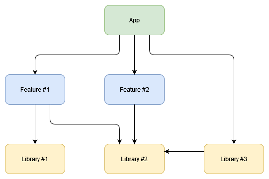
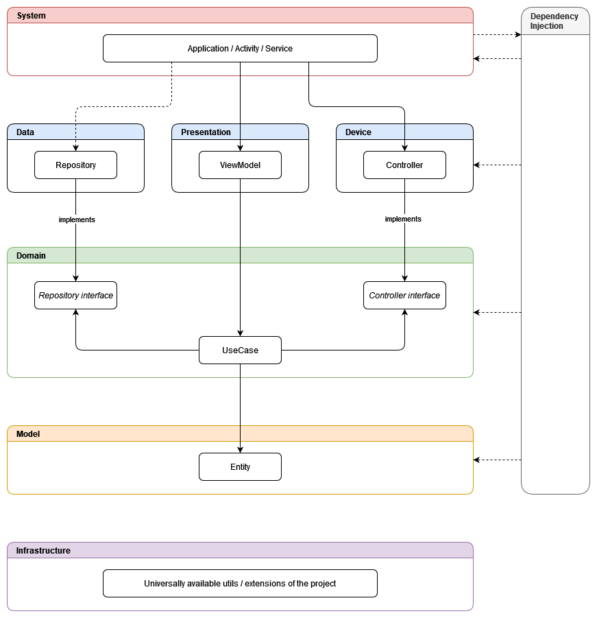

# Daily
_Your daily dose of reassurance._ No user data is being collected.

**This app was created just as a way to remind myself of how to set up a new project and tooling.**

## Tools used
- **[Jetpack Compose](https://developer.android.com/jetpack/compose)** for UI
  - **[Accompanist](https://github.com/google/accompanist)**
- **[POEditor](https://poeditor.com)** for translations
- **[JUnit4](https://junit.org/junit4/)** for unit testing
- **[Kotest](https://kotest.io/)** for unit test assertions
- **[Mockk](https://mockk.io/)** for mocking classes in unit tests
- **[Turbine](https://github.com/cashapp/turbine)** for testing Kotlin flows
- **[ArchUnit](https://www.archunit.org/userguide/html/000_Index.html)** for testing architecture compliance
- **[com.vanniktech.dependency.graph.generator](https://github.com/vanniktech/gradle-dependency-graph-generator-plugin)** for generating dependency graphs
- **[Detekt](https://detekt.dev/)** for static code analysis
- **[ProGuard](https://www.guardsquare.com/proguard)** so nobody can read our open source code

## Architecture
_Based on the Clean Architecture by Uncle Bob._

The Architecture rules are enforced through the [ArchUnit](https://www.archunit.org/userguide/html/000_Index.html) tests.

### Module dependencies
The project is divided into multiple modules:
- **App module:** binds everything together and dictates, how the app is built
- **Feature modules:** hold app specific features (e.g. login, catalogue of products, product detail, shopping cart, ...). Features are mutually independent
- **Library modules:** hold both app specific and app independent logic (e.g. data storage, networking, data processing logic used by multiple features).
    App specific logic (e.g. data processing) can be further separated into some higher level module like "common" - but that's not the case in this project, as it's unnecessary here

#### Module dependency graph generated by [gradle-dependency-graph-generator-plugin](https://github.com/vanniktech/gradle-dependency-graph-generator-plugin)

### Module structure

Each module is structured with packages based on the Clean Architecture by Uncle Bob.
- **System:** Framework classes like Android Activities, Jetpack Composable functions etc.
- **Data:** Repository implementations (in-memory storage, database, network calls, ...)
- **Device:** Controller implementations (FCM notifications, Android clipboard, ...)
- **Presentation:** View models provide observable _view state_ for UI on _System_ layer, handles UI inputs and calls _UseCases_ from _Domain_ layer
- **Domain:** Use cases contain business logic, use _repositories_ from _Data_ layer to access data and _controllers_ from _Device_ layer to interact with system (in our case, Android) - platform independent
- **Model:** Business entities which are not coupled to platform, framework or any library (database entity, rest api body, ...) 
- **Infrastructure:** Utilities and extensions universally available throughout the project
- **Dependency Injection:** Configuration for the dependency injection framework of choice used to tie all the layers together

